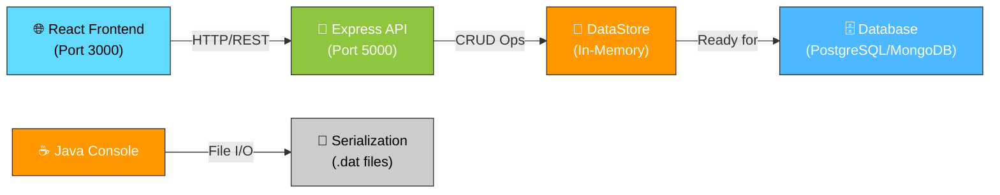
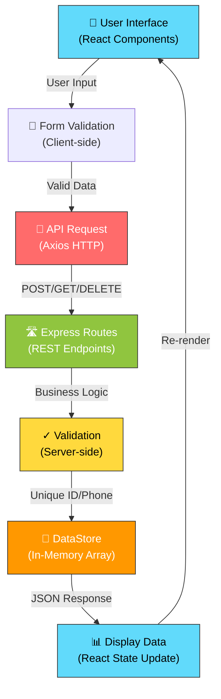
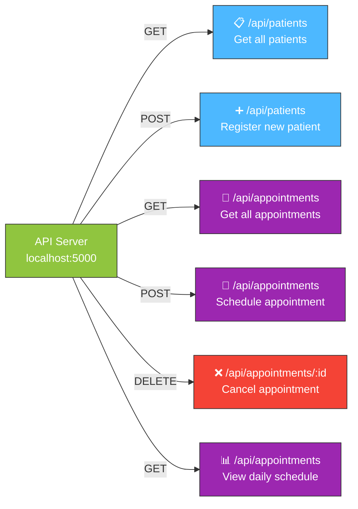
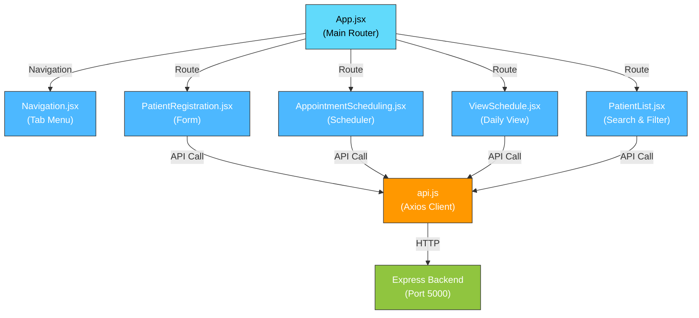
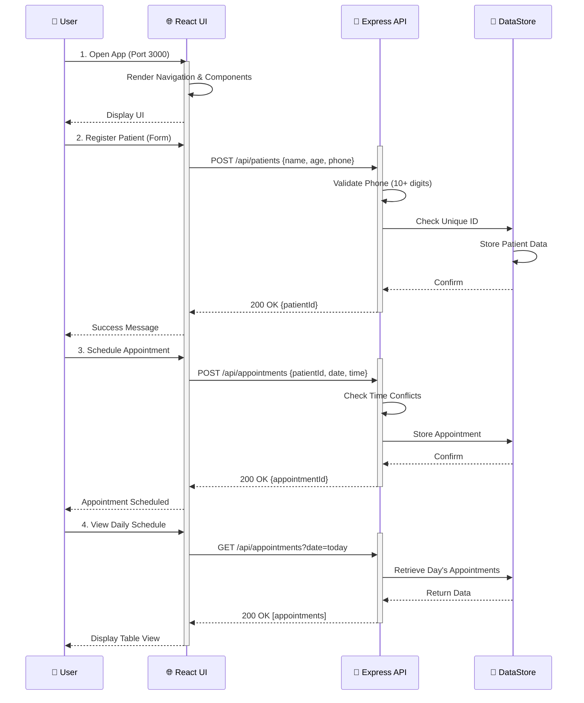
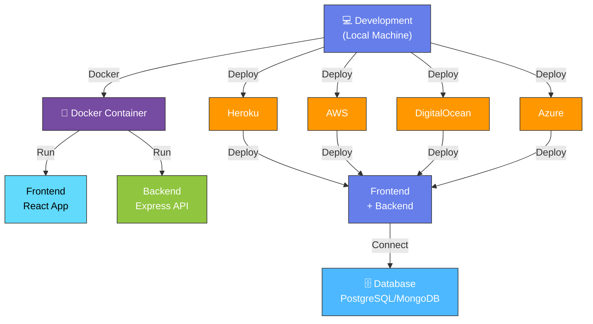

# 🏥 Clinic Management System - Web Platform


> **A Modern Web Platform** for healthcare clinic operations combining a React frontend with Express.js backend to provide a professional, user-friendly interface for managing patients and appointments.

---

## 📖 Overview

The **Clinic Management System** is a complete digital solution for healthcare clinic operations. Originally built in Java, it now features a modern **React + Express.js web platform** alongside the command-line interface.

**Dual Implementation:**
* **Web Platform:** Modern responsive UI for efficient clinic management (recommended)
* **Java Console:** Original command-line interface with file persistence

**Key Capabilities:**
* Patient registration & management with validation
* Appointment scheduling with conflict prevention
* Daily schedule viewing and management
* Real-time data synchronization
* Professional, mobile-friendly interface

## 🏗️ Architecture

### System Architecture Diagram



**Web Platform Stack:**
- Frontend: React.js (Port 3000) → Express.js API (Port 5000) → In-Memory DataStore
- Database Ready: PostgreSQL/MongoDB integration available

**Java Implementation:**
- MainApplication.java → ClinicManager.java → Java Serialization → .dat files

Both systems manage the same data structure (Patients & Appointments) independently.

## ⚙️ Features Comparison

| Feature | Web Platform | Java Console |
|---------|-------------|--------------|
| **Interface** | Modern React UI | Command-line |
| **Patient Registration** | ✅ Form-based | ✅ Input-based |
| **Appointment Scheduling** | ✅ Date picker | ✅ Manual entry |
| **Daily Schedule** | ✅ Table view | ✅ List view |
| **Patient Search** | ✅ Real-time filter | ✅ Manual search |
| **Data Persistence** | In-Memory (upgradeable) | Java Serialization |
| **Mobile Support** | ✅ Responsive | ❌ Console |

---

## 📊 Data Flow Diagram



---

## 🔌 API Endpoints



---

## 🎨 Frontend Components



---

## ⚡ User Journey



---

## 🛠️ Tech Stack

| Layer | Technology |
|-------|-----------|
| **Frontend** | React 18.2 + Vite + Axios + CSS3 |
| **Backend** | Express.js 4.18 + Node.js 14+ |
| **Original** | Java (JDK 8+) with OOP & Serialization |
| **Database** | In-Memory (Development), PostgreSQL/MongoDB (Production) |
| **Deployment** | Heroku, AWS, DigitalOcean, Docker |

## 📂 Project Structure

```
Clinic/
├── docs/
│   ├── 📄 START_HERE.md          ← Begin here!
│   ├── 📄 QUICK_REFERENCE.md     ← 5-min guide
│   ├── 📄 SETUP_GUIDE.md         ← Full setup
│   ├── 📄 ARCHITECTURE.md        ← API & design
│   └── 📄 DEPLOYMENT.md          ← Production setup
│
├── frontend/                     ← React App
│   ├── src/
│   │   ├── components/          (5 components)
│   │   ├── services/            (API client)
│   │   └── App.jsx, App.css
│   └── package.json
│
├── backend/                      ← Express API
│   ├── routes/                  (Patients, Appointments)
│   ├── models/                  (DataStore)
│   ├── server.js
│   └── package.json
│
└── Original Java Files
    ├── Appointment.java
    ├── Patient.java
    ├── ClinicManager.java
    └── MainApplication.java
```

## 🚀 Deployment Architecture



---

## 🚀 Quick Start

### Option 1: Web Platform (Recommended)

**Prerequisites:** Node.js 14+, npm 6+

```bash
# Terminal 1: Start Backend
cd backend
npm install
npm start

# Terminal 2: Start Frontend
cd frontend
npm install
npm run dev
```

Open browser → `http://localhost:3000`

### Option 2: Java Console

**Prerequisites:** JDK 8+

```bash
javac *.java
java MainApplication
```

For detailed setup, see [SETUP_GUIDE.md](SETUP_GUIDE.md)

## � Documentation

| Document | Purpose |
|----------|---------|
| **START_HERE.md** | Delivery summary & quick overview ⭐ |
| **QUICK_REFERENCE.md** | 5-minute quick start guide |
| **SETUP_GUIDE.md** | Complete installation & usage |
| **ARCHITECTURE.md** | Technical design & API specs |
| **DEPLOYMENT.md** | Production deployment (6 platforms) |
| **Readme.md** | Project overview (this file) |

**Total:** 6 essential docs, ~3,500 lines

## 🔄 Next Steps

**To Get Started:**
1. Read [START_HERE.md](START_HERE.md)
2. Follow [QUICK_REFERENCE.md](QUICK_REFERENCE.md) (5 minutes)
3. Access web platform at `http://localhost:3000`

**To Deploy:**
- See [DEPLOYMENT.md](DEPLOYMENT.md) for Heroku, AWS, DigitalOcean, Docker

**To Customize:**
- Frontend: Modify `frontend/src/` files
- Backend: Modify `backend/` files
- Add database: See DEPLOYMENT.md

**To Contribute:**
1. Fork the repository
2. Create feature branch (`git checkout -b feature/YourFeature`)
3. Commit changes (`git commit -m 'Add YourFeature'`)
4. Push branch (`git push origin feature/YourFeature`)
5. Open pull request

## � Project Stats

- **27 Total Files** (code + essential docs)
- **6 Essential Documentation Files** (streamlined)
- **21 Code Files** (React, Express, Java)
- **6 API Endpoints** fully documented
- **5 React Components** with professional styling
- **~4,000 Total Lines** (code + documentation)
- **Setup Time:** 5-10 minutes
- **Status:** ✅ Production Ready

## 📞 Support & Links

| Resource | Link |
|----------|------|
| **Quick Start** | [START_HERE.md](docs/START_HERE.md) |
| **Setup Help** | [SETUP_GUIDE.md](docs/SETUP_GUIDE.md) |
| **GitHub Repo** | [Aman35256/Clinic](https://github.com/Aman35256/Clinic) |
| **Technologies** | React, Express.js, Node.js, Java |
